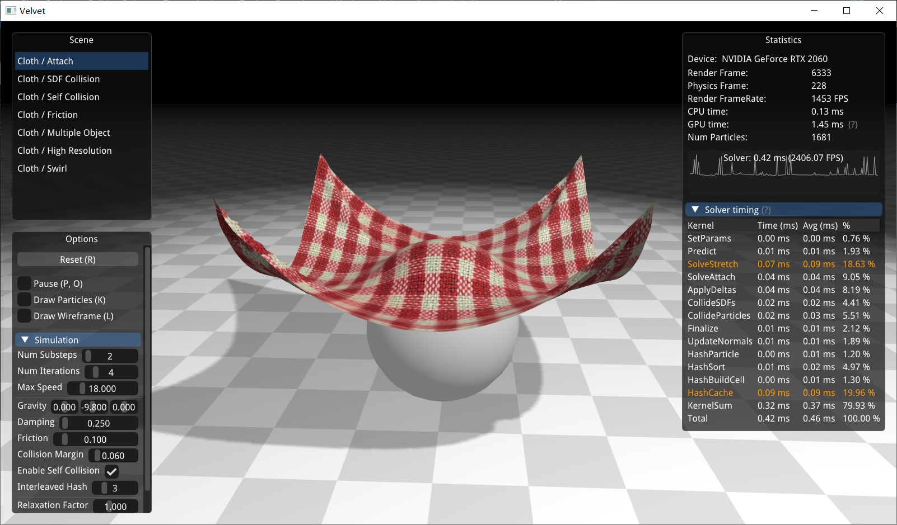

# Velvet

Velvet is a CUDA-accelerated cloth simulation engine based on Extended Position Based Dynamics (XPBD).



## Why another cloth simulator?

There are already lots of cloth simulation project around. But most of them are executed on the CPU, thus suffers from low performance.

[Flex](https://github.com/NVIDIAGameWorks/FleX) is a great GPU-accelerated physics engine which is developed by the authors of Position Based Dynamics, but the project close-sourced their physics simulation code.

It's a non-trivial task to implement cloth simulation on GPU. There are many more issues that need to solved and their solutions aren't easy to find.

This project intend to reproduce the behavior of Flex and open-source our solutions. We hope that this project can make it less painful for other developers to learn GPU cloth simulation.

## Features

* Constraints
  * Attach constraints
  * Long range attachment constraints
  * Stretch constraints
  * Bending constriants
* Collisions
  * SDF collision
  * Particle collision
  * Spatial hash neighbor finding
* OpenGL rendering


## Quick Start

Velvet is built using `Visual Studio 2019`, `C++ 17` and `CUDA 11.1`. Extra dependencies includes:

* glfw3: For window managing
* glad: For OpenGL
* fmt: For better printing functionality
* glm: For 3D mathematics
* assimp: For model loading
* imgui[core, opengl3-binding, glfw-binding]: For graphical user interface

Executable is provided and can be launched using `run_velvet.bat`.

If you want to build from source by yourself, dependencies can be installed using [vcpkg](https://github.com/microsoft/vcpkg):

```bash
./vcpkg.exe install glfw3:x64-windows
./vcpkg.exe install glad:x64-windows
./vcpkg.exe install fmt:x64-windows
./vcpkg.exe install glm:x64-windows
./vcpkg.exe install assimp:x64-windows
./vcpkg.exe install imgui[core, opengl3-binding, glfw-binding]:x64-windows
```

## Implementation Details

In computer graphics, building your own wheel can often be unevitable. But what fears most is that sometimes you don't even have recipe for the wheel you want to build. There are lots of great paper describing their methods, but many of the implementation details are left out or scattered across the internet.

The following provides some implementation details on GPU cloth simulation that may help you in someway. Most of the related code can be found in `VtClothSolverGPU.[hpp, cuh, cu]`.

### 1. Simulation pipeline

The methods and tricks of PBD is scattered across many papers and resources. Here is the summed up pipeline:

```c++
CollideSDF(); // Collide particles with Signed Distance Fields (Q1)
for (int substep = 0; substep < numSubsteps; substep++) // Reference: [Small steps in physics simulation, 2019]
{
    PredictPositions();           // Predict particle positions
    FindNeighborsBySpatialHash(); // Use spatial hashing to find particle neighbors
    
    // Handle Collisions
    CollideParticles();           // Collide particles with neighboring particles
    CollideSDF();                 // Collide particles with Signed Distance Fields
	
    // Solve constraints
    for (int iteration = 0; iteration < numIterations; iteration++)
    {
        SolveStretch();           // Stretch constraint keeps the distance between two particles
        SolveAttachment();        // Attachment constraint keeps the distance between a particle and a 3D position
        SolveBending();           // Bending constraints keeps the angle between near triangles
        ApplyDeltas();            // Apply position deltas accumulated in previous constraint solving (Q2)
    }
    
    Finalize();                   // Update velocities and positions
}
ComputeNormals();                 // Compute vertex normals for rendering
```

* Q1: Why `CollideSDF` is executed first?
  * Kinematic objects (objects controlled by animation, user input, etc.) can move really fast, and if particles collide with them inside PBD loop, particles will end up with really large velocities and produce unstable behavior (mostly large **vibration**). Therefore, we include a pre-stabilization pass (which use`CollideSDF` in our project). This pass update the particle position $x_i$ directly, therefore will not influence particle velocity.
  * Reference: [Unified particle physics for real-time applications, 2014, Section 4.4 Initial Conditions]
* Q2: What is `ApplyDeltas`?
  * In GPU implementation, we normally replace the Gauss-Seidel iteration used in CPU version with Jacobi iteration for better parallization. The downside of Jacobi iteraiton is its slow convergence. If we directly update the predicted positions, the particles will **vibrate**. To address this issue, we accumulated the position changes of all constraints into another variable `deltas`, and apply the averaged value to predicted positions in the end.
  * Reference: [Unified particle physics for real-time applications, 2014, Section 4.3 Successive Over-Relaxation]

### 2. Collision Filtering for Stable Particle Collision

In Position Based Dynamics, particle collision is an easy way to implement cloth self collision. However, the particle size can be difficult to choose. A small particle size leads to gaps inside cloth geometry, which results in particle tunneling and bumpy surface. A large particle size makes the cloth really thick and neighboring particles may constantly collide, which may results in erroneous buckling or folding.

In this project, we use a relatively large particle size (1.5x spring rest length), and employ **collision filtering** technique to ignore collisions between particles that are initially close.

A naive way to achieve collision filtering is to store all the pair of particles that are connected by springs (stretch constraints). But this data structure can be quite inefficient to query on GPU.

Our method is to store the initial particles positions in a memory buffer `initialPositions`. During particle neighbor finding phase, we can easily determine whether particles are initially close by examine their initial distances using `initialPositions`. 

Note that in industrial usage, simulators rarely use particles for collision. It's difficult to control the cloth thickness and the surface can be quite bumpy. But for simplicity's sake, particle collision is a great choice.

### 3. Avoid Stretchy Cloth by Long Range Attachments

A common problem you will notice after porting a CPU cloth solver to GPU is that cloth becomes really stretchy. This is caused by the slower convergence rate from using Jacobi iteration.

Of course you can just increase the number of substeps and iterations, but this way the performance will degrade really fast.

A relatively cheap way to address this problem is to use **Long Range Attachments** (Reference: Long range attachments - A method to simulate inextensible clothing in computer games, 2012).

The LRA is quite simple. In the original PBD, when solving an attachment constraint, you modify the attached particle's position only. With Long Range Attachment, all particles are required to stay within a distance from the attached point. This mechanism can be easily implemented by adding another attribute `attachDistances` into attachement constraints.

### 4. Performance Optimizations

**4.1 Atomic updates**

Many kernels in GPU cloth simulation use atomic updates to avoid conflict between different threads. Below is a useful method to improve the atomic performance by including a `reorder` parameter. 

The atomic updates for the x,y,z components of a vector is reordered based on the `reorder` value. This decreases the chances by `2/3` that multiple threads are updating the same memory location at the same time. 

The value of `reorder` can be choosed easily, for example stretch constraints can use the sum of two particle's ID.

```glsl
__device__ inline void AtomicAdd(glm::vec3* address, int index, glm::vec3 val, int reorder)
{
    int r1 = reorder % 3;
    int r2 = (reorder + 1) % 3;
    int r3 = (reorder + 2) % 3;
    atomicAdd(&(address[index].x) + r1, val[r1]);
    atomicAdd(&(address[index].x) + r2, val[r2]);
    atomicAdd(&(address[index].x) + r3, val[r3]);
}
```

**4.2 Spatial hashing**

We follow the CUDA sample project [particles](https://developer.download.nvidia.com/assets/cuda/files/particles.pdf) for spatial hashing implementation. There are some easy optimizations that can be made to improve its performance:

* Sort Algorithm

  The particles project use `thrust::sort_by_key` for sorting. In my experience, thrust's performance aren't that great. By replacing this with [`cub::DeviceRadiusSort::SortPairs`](https://nvlabs.github.io/cub/structcub_1_1_device_radix_sort.html), the sorting performance can be improved by roughly 50%.

* Neighbor Caching

  Spatial hashing are expensive to compute, but we don't need to update the spatial hashing every time we do particle collisions. The neighbor information can be stored in an `neighbors` array and used for multiple times. In this project, we use a integer parameter `interleavedHash` to control how many times neighbors are reused before recompute.

  The `neighbors` array are structured such that `neighbors[i + numMaxNeighborsPerParticle * j]` stores the `j-th` neighbor for particle `i`. It's not recommended to organize `neighbors` as `neighbors[i * numMaxNeighborsPerParticle + j]`since this disallows [coalesced memory access](https://developer.nvidia.com/blog/how-access-global-memory-efficiently-cuda-c-kernels/).

**4.3 Particle Rendering**

Render particles make it easier to debug. However, even with instanced rendering, it can be get quite slow to render more than 100k particles (On my laptop with RTX2060, 50k particles can't make it to 60FPS). 

A more efficient way is screen space rendering [Reference: [Screen Space Fluid Rendering for Games](https://developer.download.nvidia.com/presentations/2010/gdc/Direct3D_Effects.pdf)]. Particles are rendered in screen space as billboard quads using geometry shader. Then the normals and depth of the pixels are mannually updated to produce the illusion of spheres. This is not physically accurate but much more efficient.
